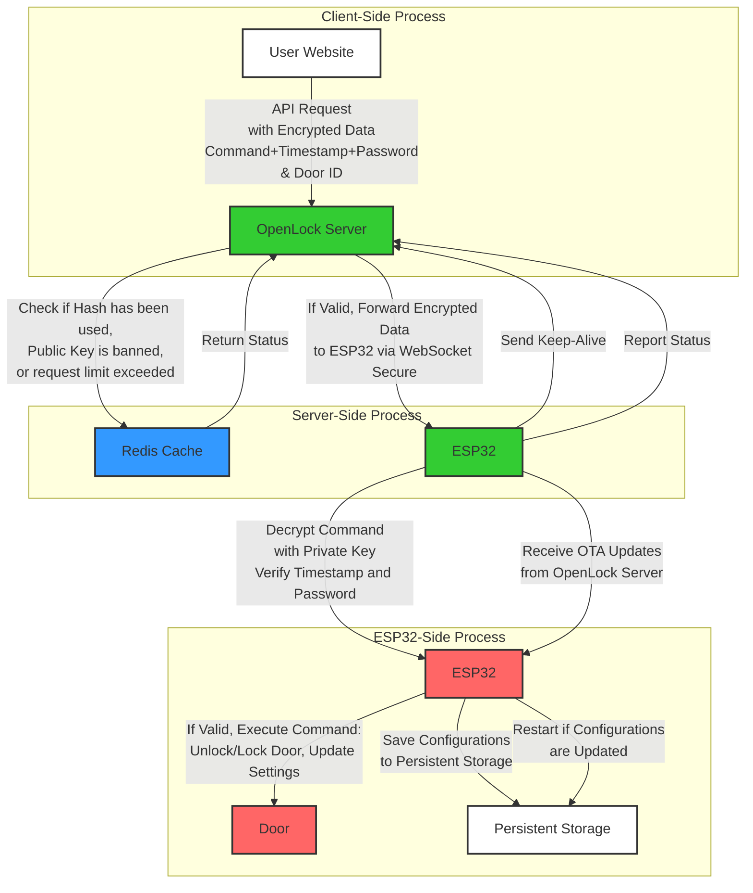

## README.md for esplock
- Author: lucasodra
- Last Updated: 2024 July 31

# Introduction

`esplock` is a secure system designed to control access using ESP32 microcontrollers. The system utilizes a client-server architecture with WebSockets for communication, AES-256 encryption for secure command transmission, and Over-the-Air (OTA) updates for firmware management. This README provides an overview of the architecture, security measures, and implementation details.

### Table of Contents

1. [Introduction](#introduction)
2. [System Architecture](#system-architecture)
   - [Key Updates and Security Enhancements](#key-updates-and-security-enhancements)
   - [Architecture Diagram](#architecture-diagram)
3. [System Workflow](#system-workflow)
4. [Security Measures](#security-measures)
5. [Industry Safety Features](#industry-safety-features)
6. [Getting Started](#getting-started)
   - [Prerequisites](#prerequisites)
   - [Installation](#installation)
   - [Key Points to Note](#key-points-to-note)
   - [Tech Stack](#tech-stack)
   - [Dependencies](#dependencies)
   - [Installing Dependencies](#installing-dependencies)
7. [ESP32 Device Implementation Requirements](#esp32-device-implementation-requirements)
   - [Broadcast Door ID and Public Key on First Connection](#broadcast-door-id-and-public-key-on-first-connection)
   - [Receive and Process Commands via WebSockets](#receive-and-process-commands-via-websockets)
   - [Respond to Status Requests](#respond-to-status-requests)
   - [Handle Updates and Reconfigurations](#handle-updates-and-reconfigurations)
   - [Security and Error Handling](#security-and-error-handling)
8. [ESP32 Technical Workflow and Corresponding Functions](#esp32-technical-workflow-and-corresponding-functions)
9. [Interpreting the Blinking Lights on ESP32](#interpreting-the-blinking-lights-on-esp32)
10. [Contributing](#contributing)
11. [License](#license)

## System Architecture

The system architecture involves three main components:

1. **Client**: Sends API requests to the OpenLock server to control ESP32 devices. The client encrypts commands using the ESP32's public key, which is obtained securely from the OpenLock server.

2. **OpenLock Server**: Handles API requests from the client, authenticates clients, and manages secure communication with the ESP32 devices. The server performs critical checks, such as validating the request against replay attacks and checking rate limits, before forwarding the encrypted command to the ESP32 via WebSocket Secure.

3. **ESP32 Device (esplock)**: An IoT device that connects to the OpenLock server via WebSocket Secure. It receives encrypted commands, decrypts them using a private key, and executes the specified actions, such as unlocking a door or updating its configuration.

### Key Updates and Security Enhancements for V2.0

- **Encryption**: The system now uses AES-256 for encrypting commands from the client, ensuring robust security for sensitive data. The commands include actions like unlocking doors, updating configuration settings, and are always transmitted securely.

- **Public Key Management**: The ESP32 generates a public-private key pair upon startup, which is tied to the Door ID and stored securely. The public key is sent to the OpenLock server over HTTPS, minimizing the risk of exposure. Clients retrieve this public key via a secure API request to OpenLock.

- **Replay Attack Prevention**: The OpenLock server validates each request by checking if the hash of the encrypted data has been used before and if the request timestamp is within an acceptable range (1 minute). This ensures that any replayed commands are rejected.

- **Configuration Updates**: The system allows updating critical configuration settings like WiFi SSID, WiFi Password, OpenLock Server Address, Door ID, and Door Password. These updates are protected by validating the preset password and are securely persisted in the ESP32's storage.

[Back to Top](#introduction)

---

### Architecture Diagram

User Settings for new ESP:
- WIFI SSID
- WIFI Password
- OpenLock Server Address
- Door ID
- Door Password



[Back to Top](#introduction)

---

## System Workflow

1. **Client Authentication**: Users authenticate with the OpenLock server using their email and website URL instead of a traditional username and password. The OpenLock server adds the authenticated website URL to its CORS policy, ensuring that only registered and verified URLs can make API requests. Upon successful authentication, users receive an API access token, which is required for all subsequent API interactions. This token verifies the identity and authorization of the client, ensuring only authenticated users can interact with the system.

2. **ESP32 First Connection**:
   - **HTTPS Request**: When the ESP32 device is first powered on or restarted, it sends an HTTPS request containing its Door ID and Public Key to the OpenLock server. The server responds with a unique session token, generated for that session.
   - **WebSocket Connection**: The ESP32 then establishes a WebSocket connection with the OpenLock server, sending the Door ID and session token. The server verifies the session token against the Door ID and stores the WebSocket connection along with the associated Door ID for future communications.

3. **Public Key Retrieval**:
   - **Client Request**: The client application sends an HTTPS request to the OpenLock server to retrieve the public key associated with a specific Door ID. The input to this request is the Door ID.
   - **Public Key Delivery**: The OpenLock server fetches the public key from the Redis cache or another secure storage location and returns it to the client. If the public key is not found, the server denies the request.

4. **Command Encryption and Forwarding**:
   - **Command Preparation**: The client uses the retrieved public key to encrypt the command, timestamp, and door password using AES-256 encryption. This encrypted data ensures that only the intended ESP32 device can decrypt and process the command.
   - **Client Command Request**: The encrypted command, along with the unencrypted Door ID, is sent to the OpenLock server using the API access token.
   - **Verification and Forwarding**: The OpenLock server verifies the API access token and session token associated with the Door ID. It then forwards the encrypted command to the specified ESP32 device via WebSocket Secure.

5. **Command Reception and Decryption**: The ESP32 device receives the encrypted command through the secure WebSocket connection. It decrypts the command using its private key and verifies the timestamp to ensure the command is fresh and valid. The ESP32 also checks the door password for correctness.

6. **Action Execution**: If the command is valid and authorized, the ESP32 device executes the specified action, such as unlocking/locking the door or updating critical configuration settings like the WiFi SSID, WiFi Password, OpenLock Server Address, Door ID, or Door Password. If the command involves updating configuration settings, the ESP32 saves the changes to persistent storage and restarts to apply the new settings.

7. **Keep-Alive and Reconnection**: To maintain a continuous and reliable connection, the ESP32 devices periodically send keep-alive messages to the OpenLock server. If the connection is lost, the devices automatically attempt to reconnect.

8. **OTA Updates**: The system supports Over-the-Air (OTA) updates, allowing the OpenLock server to push firmware updates to the ESP32 devices. This feature ensures that devices receive the latest security patches and functionality improvements without requiring physical access.

9. **Logging and Monitoring**: The system logs all actions, including successful and failed authentication attempts, command executions, and system errors. These logs are monitored for auditing and security purposes, helping to detect and respond to anomalies or potential security threats.

### In Summary:
- **ESP32 First Connection to OpenLock Server**:
  - **Broadcast Door ID and Public Key**: ESP32 sends Door ID and Public Key via HTTPS and receives a session token.
  - **OpenLock Acknowledge**: Server stores Door ID and Public Key pair along with session token.
  - **Establish WebSocket Connection**: ESP32 connects via WebSocket, sending Door ID and session token for verification.

- **Public Key Retrieval**:
  - **Client Request**: The client requests the public key for a specific Door ID from the OpenLock server.
  - **Server Response**: The server responds with the public key, enabling the client to encrypt commands.

- **OpenLock Server Forward Command to ESP32**:
  - **Receive Encrypted Command**: Server receives the encrypted command and Door ID from the client.
  - **Forward to ESP32**: Server forwards the command to ESP32 via WebSocket.
  - **ESP32 Response**: ESP32 processes the command and sends a response status.

- **OpenLock Server Request Status from ESP32**:
  - **Request Status**: Server sends a status request via WebSocket.
  - **Receive Status**: ESP32 sends back its status.
  - **Client Notification**: Server forwards the status to the client.

[Back to Top](#introduction)

---

## Security Measures

### 1. **TLS Encryption**
- All communications between clients, the OpenLock server, and ESP32 devices are secured using Transport Layer Security (TLS). This protocol ensures that data is encrypted during transmission, protecting against eavesdropping and tampering. TLS also provides data integrity, ensuring that messages cannot be altered without detection. This encryption is crucial for maintaining the confidentiality and integrity of data exchanges.

### 2. **Public-Private Key Encryption**
- Commands are encrypted with the ESP32's public key and can only be decrypted by the corresponding private key stored securely on the device. This asymmetrical encryption ensures that sensitive data, such as commands to unlock a door, cannot be intercepted or modified during transit. The private key never leaves the ESP32 device, providing an additional layer of security. The public key is transmitted to the OpenLock server via HTTPS, minimizing the risk of exposure.

### 3. **Mutual Authentication**
- Mutual authentication is enforced, requiring both the OpenLock server and the ESP32 devices to authenticate each other before establishing a connection. This two-way verification process ensures that only authorized devices and servers can communicate, preventing unauthorized devices from accessing the system and ensuring secure communication.

### 4. **Token-Based Authentication**
- Clients must obtain a JSON Web Token (JWT) to authenticate API requests to the OpenLock server. JWTs are issued after successful authentication, using the user's email and website URL. The website URL is registered with the server and added to the CORS policy, restricting API access to trusted domains only. This ensures that only registered and verified websites can make API requests, enhancing security. JWTs have expiration times to limit their validity period, and the server can refresh or revoke tokens as necessary.

### 5. **CORS Policy Enforcement**
- The OpenLock server enforces a strict Cross-Origin Resource Sharing (CORS) policy, allowing API requests only from registered and verified website URLs. This is part of the authentication process where users provide their email and website URL. The CORS policy helps prevent unauthorized websites from accessing the API, mitigating risks from cross-origin attacks and ensuring that only trusted clients can interact with the system.

### 6. **Rate Limiting and IP Blocking**
- The OpenLock server implements rate limiting to control the number of requests each token can make per second. This measure prevents abuse and protects the server from Denial of Service (DoS) attacks. Additionally, IP addresses showing suspicious behavior, such as exceeding rate limits or attempting unauthorized access, are temporarily blocked to protect against potential threats.

### 7. **Unique Device Identifiers**
- Each ESP32 device is assigned a unique identifier (UID) and a corresponding RSA key pair. The UID is used by the server to target specific devices when issuing commands, ensuring that each device can be uniquely addressed and authenticated. This prevents unauthorized devices from executing commands and ensures secure device management.

### 8. **Over-The-Air (OTA) Updates**
- The system supports OTA updates, allowing secure firmware upgrades without physical access to the ESP32 devices. This capability is crucial for deploying security patches and new features promptly, ensuring that all devices in the network run the latest and most secure firmware. OTA updates are securely transmitted and verified before application to ensure integrity and authenticity.

### 9. **Fail-Safe Mechanisms**
- In the event of a network failure or inability to contact the OpenLock server, ESP32 devices operate based on pre-configured fail-safe settings. These settings ensure that the system remains secure, maintaining the current state or reverting to a default secure state. This ensures continuous protection even if the system goes offline.

[Back to Top](#introduction)

---

## Industry Safety Features

- **Replay Attack Prevention**: Each command sent to an ESP32 device includes a unique timestamp and nonce. The OpenLock server checks if the hash of the encrypted data has been transmitted before and validates that the timestamp is within a 1-minute window. This prevents replay attacks, where an attacker could potentially re-send captured messages to replay commands, ensuring that each command is unique and timely.

- **Data Integrity**: All data transmitted between the server and devices is verified for integrity using cryptographic checksums. This ensures that any tampering with the data can be detected and mitigated. The system's use of cryptographic checksums protects against unauthorized data manipulation, ensuring that all data remains accurate and trustworthy.

- **Access Control**: The system employs role-based access control (RBAC), defining specific permissions for different types of users and devices. This ensures that only authorized users can issue sensitive commands, such as unlocking a door. RBAC helps manage access rights and enhances overall security by limiting actions to specific roles, reducing the risk of unauthorized access.

- **Logging and Monitoring**: The OpenLock system logs all actions, including successful and unsuccessful authentication attempts, command executions, and system errors. This data is monitored to detect suspicious activity and respond quickly to potential security threats, providing a robust audit trail for forensic analysis. Logging and monitoring are crucial for identifying and mitigating potential security issues, ensuring the system remains secure and reliable.

[Back to Top](#introduction)

---

## Getting Started

### Prerequisites

- **ESP32 Microcontroller**: Ensure the device has WiFi capability for network connectivity.
- **OpenLock Server**: The server must be set up with TLS for secure communication and WebSocket support to enable real-time interactions.
- **RSA Key Pair**: The ESP32 generates a public-private RSA key pair for secure command encryption and decryption. The public key is shared with the OpenLock server via HTTPS to ensure secure communication.

### Installation

1. **Clone the Repository**
   Clone the `esplock` repository to your local development environment:
   ```bash
   git clone https://github.com/lucasodra/esplock.git
   cd esplock
   ```

2. **Configure WiFi and Server Details**
   Open the `firmware.cpp` file and update the following details:
   - **WIFI_SSID**: Your WiFi network name.
   - **WIFI_PASSWORD**: Your WiFi password.
   - **SERVER_ADDRESS**: The domain or IP address of the OpenLock server.
   - **DOOR_ID**: A unique identifier for the door controlled by the ESP32.
   - **DOOR_PASSWORD**: A secure password for additional authentication.

3. **Upload the Firmware**
   Use the Arduino IDE or PlatformIO to compile and upload the firmware to your ESP32 device:
   - **Arduino IDE**: Open the `firmware.cpp` file, select your ESP32 board and port, and click "Upload."
   - **PlatformIO**: Navigate to the project directory and run the upload command.

4. **Monitor the Serial Output**
   Open the Serial Monitor in the Arduino IDE or PlatformIO to observe the ESP32's activity, such as key generation, connection attempts, and command execution. This is useful for debugging and ensuring the system operates as expected.

[Back to Top](#introduction)

---

### Tech Stack

The `esplock` system utilizes the following technologies:

- **ESP32 Microcontroller**: A versatile microcontroller with WiFi and Bluetooth capabilities, ideal for controlling physical door locks.
- **WebSocket Protocol**: Facilitates real-time, bidirectional communication between the OpenLock server and ESP32 devices, ensuring efficient command delivery.
- **RSA Encryption**: Secures commands by encrypting them with the ESP32's public key and decrypting them on the device, ensuring robust data protection.
- **TLS/SSL**: Ensures secure data transmission over the network, preventing interception and maintaining data integrity.
- **Arduino Framework**: A comprehensive development platform for programming the ESP32, supported by extensive libraries.
- **mbedTLS**: A lightweight cryptographic library providing RSA encryption and secure communication protocols.
- **OTA Updates**: Allows remote firmware updates, facilitating the deployment of security patches and new features without physical access to devices.

### Dependencies

The following libraries and versions are required for the ESP32 firmware:

| Dependency              | Version   | Description                                              |
|-------------------------|-----------|----------------------------------------------------------|
| **Arduino Core for ESP32** | 1.0.6 or later | Core library for ESP32 development, including WiFi and networking capabilities. |
| **WiFiClientSecure**    | Built-in  | Provides secure communication over SSL/TLS for WiFi clients. |
| **WebSocketsClient**    | 2.3.5     | Enables WebSocket communication for real-time interactions with the server. |
| **ArduinoJson**         | 6.18.5    | A flexible JSON library used for parsing and creating JSON data structures. |
| **Adafruit NeoPixel**   | 1.7.0     | Controls RGB LEDs for visual status indication and feedback. |
| **mbedTLS**             | 2.16.3    | Provides cryptographic functionalities, including RSA and TLS/SSL. |
| **ArduinoOTA**          | Built-in  | Facilitates OTA updates, enabling remote firmware upgrades. |
| **Ticker**              | Built-in  | A library for creating software timers, useful for periodic tasks like keep-alive signals. |

### Installing Dependencies

To install these dependencies, follow the steps below using either the Arduino IDE or PlatformIO.

**Arduino IDE:**

1. Open the Arduino IDE.
2. Go to `Sketch` > `Include Library` > `Manage Libraries...`.
3. Search for and install the required libraries.

**PlatformIO:**

Add the following to your `platformio.ini` file:

```ini
[env:esp32]
platform = espressif32
board = esp32dev
framework = arduino
lib_deps =
    arduino-libraries/ArduinoJson@^6.18.5
    knolleary/WebSockets@^2.3.5
    adafruit/Adafruit NeoPixel@^1.7.0
    espressif/arduino-esp32
```

[Back to Top](#introduction)

---

### ESP32 Device Implementation Requirements

#### 1. **Broadcast Door ID and Public Key on First Connection**

**Objective**: Register the device with the OpenLock server.

**Technical Requirements**:
- **Generate RSA Key Pair**: On first boot or if keys are not present, generate an RSA key pair (2048-bit minimum). The private key is securely stored on the ESP32, while the public key is used for communication.
- **Store Public Key**: Persist the public key on the device in a secure manner, ensuring it can be retrieved after reboots.
- **Send Registration Data**: Send an HTTPS POST request to the OpenLock server with the following payload:
  - **Door ID**: A unique identifier for the ESP32 device.
  - **Public Key**: The RSA public key generated by the ESP32.
- **Handle Acknowledgment**: 
  - Receive and handle the server's acknowledgment, which includes a unique session token. 
  - Store the session token for use in WebSocket communication.
  - Implement retry logic for handling registration failures due to network issues or server errors.

#### 2. **Receive and Process Commands via WebSockets**

**Objective**: Execute commands sent from the OpenLock server.

**Technical Requirements**:
- **Connect to WebSocket Server**: Establish a secure WebSocket connection using the server address and session token received during registration. Ensure the connection is authenticated and encrypted (WSS).
- **Command Listener**: Implement a continuous listener for incoming WebSocket messages.
- **Decrypt and Validate**:
  - **Decryption**: Decrypt the received command using the stored private key. The command is expected to be encrypted using the public key initially sent to the server.
  - **Timestamp Validation**: Check the timestamp within the decrypted command to ensure it falls within an acceptable range, preventing replay attacks.
  - **Authentication Check**: Verify the command's authenticity using the preset password stored on the device.
- **Execute Commands**: 
  - **Actions**: Perform the action specified in the command, such as unlocking/locking the door or updating device settings.
  - **Response**: Send a response status back to the OpenLock server indicating success (200) or failure (400) of the command execution.

#### 3. **Respond to Status Requests**

**Objective**: Provide the current status of the device upon request.

**Technical Requirements**:
- **Status Request Listener**: Listen for status request messages from the OpenLock server via WebSocket.
- **Compile Status Information**: Collect relevant status details, including:
  - **Connection Status**: Whether the device is online and connected.
  - **Last Command Status**: Information about the last executed command, including any errors.
  - **System Metrics**: Optional data such as battery level (if applicable), signal strength, etc.
- **Send Status Response**: Transmit the compiled status information back to the OpenLock server.

#### 4. **Handle Updates and Reconfigurations**

**Objective**: Update device settings or firmware as needed.

**Technical Requirements**:
- **OTA Updates**: 
  - Implement Over-The-Air (OTA) update capabilities, allowing the OpenLock server to push firmware updates securely to the device.
  - Ensure the integrity and authenticity of the firmware before installation.
- **Settings Reconfiguration**:
  - Upon receiving commands to update WiFi credentials, server address, or other critical settings, validate the data and store it securely.
  - If a critical setting changes (e.g., server address), restart the device to apply the new configuration.

#### 5. **Security and Error Handling**

**Objective**: Ensure secure and reliable operations.

**Technical Requirements**:
- **Encryption**: Use RSA (for command decryption) and AES-256 (for encrypting sensitive data stored on the device) to secure communications and data.
- **Error Handling**: Implement comprehensive error handling mechanisms, including:
  - **Failed Decryption**: Handle cases where decryption fails, possibly due to incorrect data or key mismatches.
  - **Invalid Commands**: Safely manage and log invalid or unauthorized commands received from the server.
  - **Connectivity Issues**: Detect and attempt to resolve connectivity issues with the OpenLock server, including automatic reconnections.
- **Logging and Monitoring**: Maintain logs for key actions and errors. These logs are crucial for debugging, auditing, and monitoring device performance and security incidents.

[Back to Top](#introduction)

---

### ESP32 Technical Workflow and Corresponding Functions

#### 1. **Broadcast Door ID and Public Key on First Connection**

**Workflow:**
- **Generate RSA Key Pair**: On first boot or if keys are not present, generate an RSA key pair.
  - **Function:** `generateAndStoreKeyPair()`
- **Send Registration Data**: Send an HTTPS POST request to the OpenLock server containing the Door ID and Public Key.
  - **Function:** `sendDoorIDAndPublicKey()`

#### 2. **Receive and Process Commands via WebSockets**

**Workflow:**
- **Connect to WebSocket Server**: Establish a secure WebSocket connection with the OpenLock server.
  - **Function:** `connectToWebSocket()`
- **Listen for Commands**: Continuously listen for incoming commands via the WebSocket connection.
  - **Function:** `handleWebSocketMessage(WsMessage message)`
- **Decrypt and Validate**: Decrypt the received command using the private key, validate the timestamp, and verify the command using the preset password.
  - **Function:** `rsaDecrypt(const char* input, size_t input_len, char* output, size_t* output_len)`
  - **Function:** `processCommand(const char* decryptedCommand)`
  - **Function:** `validatePresetPassword(const char* providedPassword)`
  - **Function:** `validateTimestamp(const char* timestamp)`
- **Execute Commands**: Execute the command, such as unlocking/locking the door or updating settings, and send a response status.
  - **Functions:** 
    - `unlockDoor()`
    - `lockDoor()`
    - `saveWiFiCredentials(const String &ssid, const String &password)`
    - `saveServerAddress(const String &address)`
    - `savePresetPassword(const String &password)`
  - **Response Status:** Handled within `processCommand()`

#### 3. **Respond to Status Requests**

**Workflow:**
- **Receive Status Request**: Listen for status request messages via the WebSocket connection.
  - **Function:** `handleWebSocketMessage(WsMessage message)`
- **Compile Status Information**: Gather necessary information such as connection status and last command executed.
  - **Part of Function:** `sendStatus()`
- **Send Status Response**: Send the compiled status information back to the OpenLock server.
  - **Function:** `sendStatus()`

#### 4. **Handle Updates and Reconfigurations**

**Workflow:**
- **OTA Updates**: Implement Over-The-Air (OTA) update capability to receive firmware updates securely.
  - **Functions:** Managed by Arduino OTA library callbacks in the `setup()`
- **Reconfigure Settings**: Validate and save the new settings (WiFi SSID, password, server address, or preset password) upon receiving commands.
  - **Functions:**
    - `saveWiFiCredentials(const String &ssid, const String &password)`
    - `saveServerAddress(const String &address)`
    - `savePresetPassword(const String &password)`
  - **Restart Device if Needed:** Handled within `processCommand()` by calling `ESP.restart()` if necessary.

#### 5. **Security and Error Handling**

**Workflow:**
- **Encryption**: Use RSA and AES-256 for secure communications.
  - **Functions:** `rsaDecrypt()`, `generateAndStoreKeyPair()`
- **Error Handling**: Implement robust error handling for failed decryption, invalid commands, and connectivity issues.
  - **Functions:** Error handling and logging are integrated within `processCommand()`, `handleWebSocketMessage()`, and other critical functions.
- **Logging and Monitoring**: Maintain logs for actions taken and errors encountered for debugging and audit purposes.
  - **Implementation:** Throughout the code with `Serial.println()` for debugging.

[Back to Top](#introduction)

---

## Interpreting the Blinking Lights on ESP32

The ESP32 uses a NeoPixel LED to visually indicate different states and actions. Below is a table explaining the meaning of each blinking pattern.

| Color           | Blinking Pattern                 | Description                                                     |
|-----------------|----------------------------------|-----------------------------------------------------------------|
| **Blue**        | 1 blink every 500ms              | Connecting to WiFi                                              |
| **Green**       | 3 blinks, 100ms delay            | Successfully connected to WiFi                                  |
| **Orange**      | 1 blink every 500ms              | Attempting to connect to WebSocket server                       |
| **Green**       | 5 blinks, 100ms delay            | Successfully connected to WebSocket server                      |
| **White**       | 1 blink, 100ms delay             | Received a new command from the server                          |
| **Red**         | 5 blinks, 100ms delay            | Error in processing, such as failed decryption or parsing       |
| **Blue**        | 1 blink, 100ms delay             | Sending a keep-alive message to the WebSocket server            |
| **Green**       | 5 blinks, 100ms delay            | Door unlocked                                                   |
| **Red**         | 5 blinks, 100ms delay            | Door locked                                                     |
| **Yellow**      | 5 blinks, 100ms delay            | Updating WiFi credentials, server address, or preset password   |
| **Purple**      | 5 blinks, 100ms delay            | OTA update in progress                                          |
| **Cyan**        | 5 blinks, 100ms delay            | Ping response sent (public key or status requested)             |

[Back to Top](#introduction)

---

### Note
- The LED will turn off after completing the blinking pattern for each event.
- For any critical errors, the device may repeat the red blinking pattern until the issue is resolved.

---
## Contributing

We welcome contributions to enhance the security and functionality of the esplock system. Please fork the repository and create a pull request with your changes.

## License

This project is licensed under the MIT License - see the [LICENSE](LICENSE) file for details.