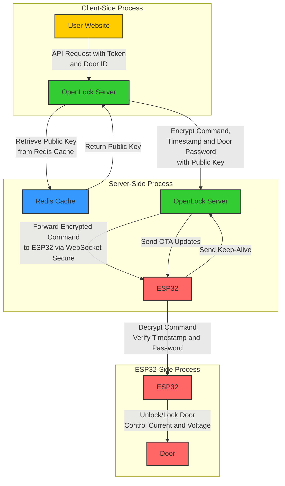

## README.md for esplock
- Author: lucasodra
- Last Updated: 2024 July 31

# esplock

`esplock` is a secure system designed to control access using ESP32 microcontrollers. The system utilizes a client-server architecture with WebSockets for communication, RSA encryption for secure command transmission, and Over-the-Air (OTA) updates for firmware management. This README provides an overview of the architecture, security measures, and implementation details.

## Architecture Overview

The system architecture involves three main components:

1. **Client**: Sends API requests to the OpenLock server to unlock ESP32 devices.
2. **OpenLock Server**: Handles API requests, authenticates clients, encrypts commands with the ESP32's public key, and broadcasts commands via WebSocket.
3. **ESP32 Device (esplock)**: Connects to the OpenLock server via WebSocket, receives encrypted commands, decrypts them using a private key, and executes actions such as unlocking a door.

### Architecture Diagram



## System Workflow

1. **Client Authentication**: Users authenticate with the OpenLock server and obtain an API access token. This token is used to authorize further requests, ensuring that only authenticated users can interact with the system.

2. **Command Request**: Users send a command request (e.g., unlock door) to the OpenLock server using the API access token. The request includes the Door ID, indicating which door should be unlocked.

3. **Public Key Retrieval**: The OpenLock server retrieves the target ESP32 device's public key from the Redis cache using the Door ID. If the public key is not present in the cache, the server denies the request.

4. **Command Encryption**: The user device encrypts the command, a timestamp, and the door password using the ESP32's public key. This encrypted data, along with the unencrypted Door ID, is then sent to the OpenLock server.

5. **Command Validation and Forwarding**: The OpenLock server validates the API access token and checks for any security flags (e.g., IP blocking, rate limits). If valid, the server uses the Door ID to identify the appropriate ESP32 device and forwards the encrypted command over WebSocket Secure.

6. **Command Reception and Decryption**: The target ESP32 device receives the encrypted command. It decrypts the command using its private key, verifying the timestamp to prevent replay attacks and checking the door password for validity.

7. **Action Execution**: If the command is valid and authorized, the ESP32 device executes the action, such as unlocking the door.

8. **Keep-Alive and Reconnection**: The ESP32 devices maintain the WebSocket connection by sending periodic keep-alive messages. If the connection is lost, they automatically attempt to reconnect to ensure continuous communication.

9. **OTA Updates**: The system supports Over-the-Air (OTA) updates, allowing the OpenLock server to push the latest firmware updates to the ESP32 devices. This ensures the devices are up-to-date with the latest security patches and features.

10. **Logging and Monitoring**: All actions and events are logged and monitored for auditing and security purposes. This includes successful and failed authentication attempts, command requests, and any anomalies detected in the system.

## Security Measures

### 1. **TLS Encryption**
- All communications between clients, the OpenLock server, and ESP32 devices are secured using Transport Layer Security (TLS). This protocol ensures that data is encrypted during transmission, protecting against eavesdropping and tampering. TLS also provides data integrity, ensuring that messages cannot be altered without detection.

### 2. **Public-Private Key Encryption**
- Commands are encrypted with the ESP32's public key, and can only be decrypted by the corresponding private key stored securely on the device. This asymmetrical encryption ensures that sensitive data, such as commands to unlock a door, cannot be intercepted or modified during transit. The private key never leaves the ESP32 device, adding an additional layer of security.

### 3. **Mutual Authentication**
- Mutual authentication is enforced, requiring both the OpenLock server and the ESP32 devices to authenticate each other before establishing a connection. This two-way verification process prevents unauthorized devices from accessing the system and ensures that communication occurs only between trusted entities.

### 4. **Token-Based Authentication**
- Clients must obtain a JSON Web Token (JWT) to authenticate API requests to the OpenLock server. JWTs are issued after successful authentication and include expiration times to limit their validity period. The server can refresh or revoke tokens as necessary, adding flexibility and security in managing user sessions.

### 5. **Rate Limiting and IP Blocking**
- The OpenLock server enforces rate limiting, restricting the number of requests each token can make per second. This measure helps prevent abuse and Denial of Service (DoS) attacks. Additionally, IP addresses exhibiting suspicious behavior, such as spamming or exceeding rate limits, are temporarily blocked to mitigate potential threats.

### 6. **Unique Device Identifiers**
- Each ESP32 device is assigned a unique identifier (UID) along with a corresponding RSA key pair. The UID is used by the server to target specific devices when issuing commands. This system ensures that each device can be uniquely addressed and authenticated, preventing unauthorized devices from executing commands.

### 7. **Over-The-Air (OTA) Updates**
- The system supports OTA updates, allowing secure firmware upgrades without physical access to the ESP32 devices. This capability is crucial for deploying security patches and new features promptly, ensuring that all devices in the network are running the latest and most secure firmware.

### 8. **Fail-Safe Mechanisms**
- In the event of a network failure or inability to contact the OpenLock server, ESP32 devices operate based on pre-configured fail-safe settings. These settings are designed to ensure that the system remains secure, such as maintaining the current state or reverting to a default secure state. This ensures that security is not compromised even if the system goes offline.

## Industry Safety Features

- **Replay Attack Prevention**: Each command sent to an ESP32 device includes a unique timestamp and nonce. This prevents replay attacks, where an attacker could potentially re-send captured messages to replay commands.
- **Data Integrity**: All data transmitted between the server and devices is verified for integrity using cryptographic checksums. This ensures that any tampering with the data can be detected and mitigated.
- **Access Control**: The system employs role-based access control (RBAC), defining specific permissions for different types of users and devices. This ensures that only authorized users can issue sensitive commands, such as unlocking a door.
- **Logging and Monitoring**: The OpenLock system logs all actions, including successful and unsuccessful authentication attempts, command executions, and system errors. This data is monitored to detect suspicious activity and respond quickly to potential security threats, providing a robust audit trail for forensic analysis.

## Getting Started

### Prerequisites

- **ESP32 Microcontroller**: Ensure the device has WiFi capability for network connectivity.
- **OpenLock Server**: The server must be set up with TLS for secure communication and WebSocket support to enable real-time interactions.
- **RSA Key Pair**: Generate a public-private RSA key pair on the ESP32 for secure command encryption and decryption.

### Installation

1. **Clone the Repository**
   Clone the `esplock` repository to your local development environment:
   ```bash
   git clone https://github.com/lucasodra/esplock.git
   cd esplock
   ```

2. **Configure WiFi and Server Details**
   Open the `firmware.cpp` file and update the WiFi credentials and server details:
   - **WIFI_SSID**: Your WiFi network name
   - **WIFI_PASSWORD**: Your WiFi password
   - **SERVER_ADDRESS**: The domain or IP address of the OpenLock server

3. **Upload the Firmware**
   Use the Arduino IDE or PlatformIO to compile and upload the firmware to your ESP32 device:
   - **Arduino IDE**: Open the `firmware.ino` file, select your ESP32 board and port, and click "Upload."
   - **PlatformIO**: Navigate to the project directory and run the upload command.

4. **Monitor the Serial Output**
   Open the Serial Monitor in the Arduino IDE or PlatformIO to observe the ESP32's activity, such as key generation, connection attempts, and command execution. This can help in debugging and ensuring the system operates as expected.

### Tech Stack

The `esplock` system utilizes the following technologies:

- **ESP32 Microcontroller**: A low-cost, low-power system on a chip with WiFi and Bluetooth capabilities, used to control physical door locks.
- **WebSocket Protocol**: Allows real-time, bidirectional communication between the OpenLock server and ESP32 devices, ensuring low-latency command delivery.
- **RSA Encryption**: Provides robust security for commands by encrypting them with the ESP32's public key and decrypting them with the private key on the device.
- **TLS/SSL**: Secures data transmission over the network, protecting against interception and ensuring data integrity.
- **Arduino Framework**: Offers a simple development environment for programming the ESP32, supported by a vast library ecosystem.
- **mbedTLS**: A lightweight cryptographic library that implements RSA encryption and secure communication protocols.
- **OTA Updates**: Enables remote firmware updates, allowing the deployment of security patches and new features without physical access to devices.

### Dependencies

The following libraries and versions are required for the ESP32 firmware:

| Dependency              | Version   | Description                                              |
|-------------------------|-----------|----------------------------------------------------------|
| **Arduino Core for ESP32** | 1.0.6 or later | Core library for ESP32 development, including WiFi and networking capabilities. |
| **WiFiClientSecure**    | Built-in  | Provides secure communication over SSL/TLS for WiFi clients. |
| **WebSocketsClient**    | 2.3.5     | Enables WebSocket communication for real-time interactions with the server. |
| **ArduinoJson**         | 6.18.5    | A flexible JSON library used for parsing and creating JSON data structures. |
| **Adafruit NeoPixel**   | 1.7.0     | Controls RGB LEDs for visual status indication and feedback. |
| **mbedTLS**             | 2.16.3    | Provides cryptographic functionalities, including RSA and TLS/SSL. |
| **ArduinoOTA**          | Built-in  | Facilitates OTA updates, enabling remote firmware upgrades. |
| **Ticker**              | Built-in  | A library for creating software timers, useful for periodic tasks like keep-alive signals. |

### Installing Dependencies

To install these dependencies, follow the steps below using either the Arduino IDE or PlatformIO.

**Arduino IDE:**

1. Open the Arduino IDE.
2. Go to `Sketch` > `Include Library` > `Manage Libraries...`.
3. Search for and install the required libraries.

**PlatformIO:**

Add the following to your `platformio.ini` file:

```ini
[env:esp32]
platform = espressif32
board = esp32dev
framework = arduino
lib_deps =
    arduino-libraries/ArduinoJson@^6.18.5
    knolleary/WebSockets@^2.3.5
    adafruit/Adafruit NeoPixel@^1.7.0
    espressif/arduino-esp32
```

## Interpreting the Blinking Lights on ESP32

The ESP32 uses a NeoPixel LED to visually indicate different states and actions. Below is a table explaining the meaning of each blinking pattern.

| Color           | Blinking Pattern                 | Description                                                     |
|-----------------|----------------------------------|-----------------------------------------------------------------|
| **Blue**        | 1 blink every 500ms              | Connecting to WiFi                                              |
| **Green**       | 3 blinks, 100ms delay            | Successfully connected to WiFi                                  |
| **Orange**      | 1 blink every 500ms              | Attempting to connect to WebSocket server                       |
| **Green**       | 5 blinks, 100ms delay            | Successfully connected to WebSocket server                      |
| **White**       | 1 blink, 100ms delay             | Received a new command from the server                          |
| **Red**         | 5 blinks, 100ms delay            | Error in processing, such as failed decryption or parsing       |
| **Blue**        | 1 blink, 100ms delay             | Sending a keep-alive message to the WebSocket server            |
| **Green**       | 5 blinks, 100ms delay            | Door unlocked                                                   |
| **Red**         | 5 blinks, 100ms delay            | Door locked                                                     |

### Note
- The LED will turn off after completing the blinking pattern for each event.
- For any critical errors, the device may repeat the red blinking pattern until the issue is resolved.


## Contributing

We welcome contributions to enhance the security and functionality of the esplock system. Please fork the repository and create a pull request with your changes.

## License

This project is licensed under the MIT License - see the [LICENSE](LICENSE) file for details.